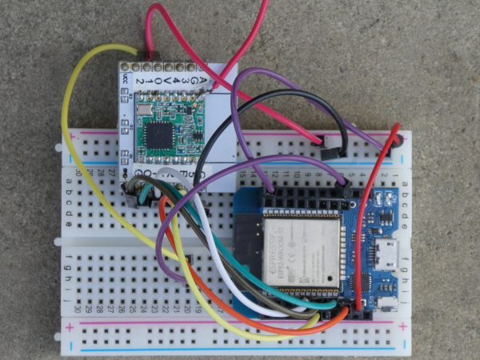
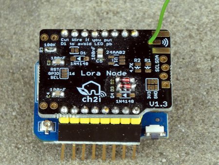
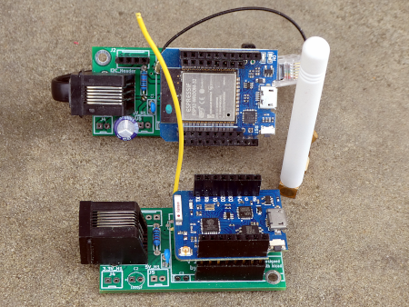

# LoRa peer to peer with ESP8266 or ESP32 and SX1276

## All infos on: <https://www.weigu.lu/microcontroller/lora_p2p_SX_esp/index.html>

## Some infos

With an ESP8266 (Wemos/Lolin D1 mini (pro) or an ESP32 (MHETLIVE Minikit) and the LoRa library from Sandeep Mistry it is easy to build a LoRa p2p device.
Here it is done on a breadboard or by using PCBs from Charles-Henri Hallard (CH2i) or the SmartyReader&reg; board v2.2.
Some simple statndard examples show how to use the library (sender, receiver, transceiver with callback).

